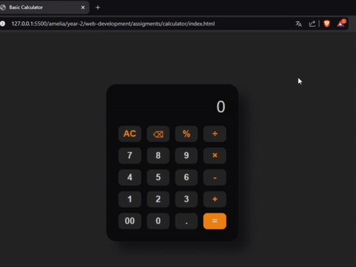

# Calculadora – DevWeb

## Sobre o Projeto

Esta calculadora foi desenvolvida como parte de uma atividade da disciplina de **Desenvolvimento Web (2025)**, onde cada aluno criou uma versão de uma calculadora funcional utilizando **HTML, CSS e JavaScript**. O design desse projeto foi inspirado na calculadora dos celulares da **Xiaomi**.

## Tecnologias Utilizadas

<p align="center">
  
  
  
</p>

<p>
  Este projeto utiliza <b>HTML5</b> para a estrutura da interface, <b>CSS3</b> para estilização e <b>JavaScript</b> para a lógica de cálculos.
</p>

## Estrutura do Projeto

```
/calculator
│── index.html          # Página principal
│── README.md           # Documentação do projeto
│── /styles
│   ├── style.css       # Arquivo de estilização │── /scripts
│   ├── script.js       # Lógica da calculadora
```

## Funcionalidades

- Realiza operações básicas: **adição (+), subtração (-), multiplicação (×), divisão (÷)** e **módulo (%)**
- Botão **AC** para apagar tudo
- Botão de **backspace** para deletar caracteres individualmente
- Interface inspirada na calculadora da **Xiaomi**
- Design responsivo e interativo


## Como Usar  

Para utilizar a calculadora na sua máquina localmente, siga os passos abaixo:

1. **Baixe o projeto**  
   - Clone o repositório com o Git:  
     ```sh
     git clone https://github.com/lucaaszsx/amelia.git
     ```
   - Ou faça o download do código como **ZIP** e extraia os arquivos.

2. **Abra o arquivo HTML**  
   - Navegue até a pasta do projeto e abra o arquivo `index.html` no seu navegador.  
   - Não é necessário instalar nada, pois o projeto usa apenas HTML, CSS e JavaScript puro.

## Pré-visualização

<p align="center">
  
</p>

## Autor

<p align="center">
  <a href="https://github.com/lucaaszsx">
    
  </a>
</p>

<p>
  Este projeto foi desenvolvido por <b>lucaaszsx (Lucas)</b> como parte de uma atividade prática da disciplina de Desenvolvimento Web.
</p>

## Licença
<p align="center">
  
</p>

Este projeto é de domínio público sob a **Unlicense**. Você pode usá-lo, modificá-lo e distribuí-lo livremente.